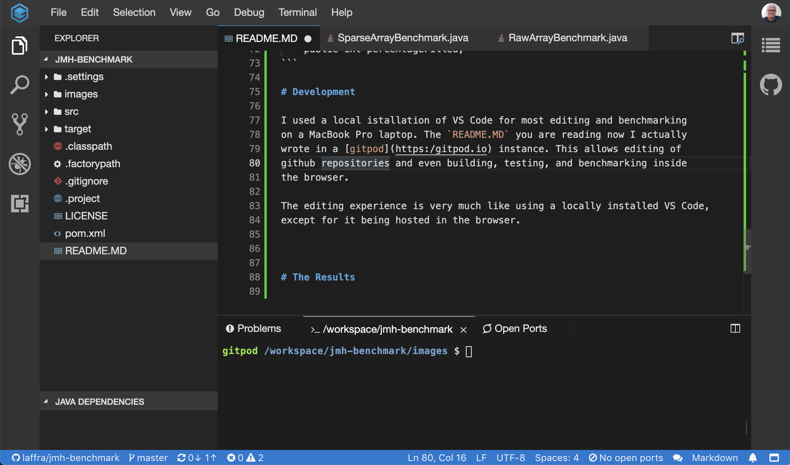

# JMH Benchmark Example

This repository contains a JMH project to run microbenchmarks on Java code.

In this repo you will find some simple Java source, that implements a so-called
`SparseArray`, as found in the Android runtime. The main idea is to offer up
an API similar to a normal array, but to optimize for the case where there are
gaps in the range of indices into the array.

The main goal of `SparseArray` is to save memory, as a normal array forces the
JVM to allocate all the memory, even when the indices in the array are not used.
The golden rule of performance is that it is a space-time tradeoff. So, if we
are saving space, what are we sacrificing in performance? That is the goal of
the JMH benchmark we show here.

Java benchmarks are hard to write correctly. The
[JMH benchmark](http://tutorials.jenkov.com/java-performance/jmh.html)
offers a testing harness that collects all lessons learned from many different
testing harnesses developed in the past. Things to worry about are properly warming
up the JVM so that JITs have a chance to identify hot code and compile the bytecode
in the warmup phase, to not disrupt the measurements later on. JMH also run
multiple iterations of the code under study, to remove statistical anomalies.

The algorithm we are benchmarking in this repo, `SparseArray`, is implemented
in three different formats:
 - As an `ArrayList`
 - As a `TreeMap`
 - As a set of two arrays using binary search on the keys

 Option 3 is the most memory efficient, not having the overhead of an array
 list. It also does not have the autoboxing overhead of Java collections, such as `TreeMap`.
 What we would like to know is which one performs best, performance wise.
 In other words, which one gives us the best space-time tradeoff?

 # Getting Started

 The JMH benchmark in this repo was developed using VS Code. Here are the steps
 I followed:
  - Install [VSCode](https://code.visualstudio.com/download)
  - Install the
    [Java Extension Pack](https://marketplace.visualstudio.com/items?itemName=vscjava.vscode-java-pack)
  - The extension pack comes with `Maven` support. I used that to create a new
    JMH project by searching for the `jmh-java-benchmark-archetype` which is
    available in the remote catalog.

At this point, you are basically ready to create JMH projects and run
benchmarks in them. My next steps were:

  - In the generated project, I added my `SparseArray` implementation
  - I wrote Unit Tests
  - I wrote two benchmarks, one that tries out the three implementations,
    and one that exercises the same logic using a raw Java `int[]`.

# The Structure of a JMH Benchmark

There are many tutorials on writing JMH benchmarks, so I will not spend
too much time here. The basic starting point is the
[JMH docs](https://openjdk.java.net/projects/code-tools/jmh/). I found
the tutorial at [Baeldung.com](https://www.baeldung.com/java-microbenchmark-harness)
handy as it gives a nice and short intro to each feature, including
things such as `State` annotations, to run the benchmark using different
parameters, as I do in this repo as well.

A benchmark can be run with different combinations of parameters
using a simple, declarative specification:

```
@State(Scope.Benchmark)
public class SparseArrayBenchmark {
    @Param({ "MAP", "LIST", "BINARY" })
    public String implementationType;

    @Param({ "1", "10", "100" })
    public int percentageFilled;
```

# Development

I used a local istallation of VS Code for most editing and benchmarking,
on a MacBook Pro laptop. The `README.MD` you are reading now I actually
wrote in a [gitpod](https:/gitpod.io) instance. This allows editing of
github repositories and even building, testing, and benchmarking inside
the browser.

The gitpod editing experience is very much like using a locally installed
VS Code, except for it being hosted in the browser:



As part of the build, the unit tests are executed using
[Apache Maven Surefire](https://github.com/apache/maven-surefire):


The JMH benchmark requires a special build step, using Maven, `mvn install`.
After running the build, the benchmarks are executed by running the generated
benchmarks jar, produced by the build step:


The benchmark ran a bit slow on the gitpod server, so I ran them on
my MacBook. That said, the entire development/test/build/benchmark
loops can be done entirely in the browser. We live in exciting times indeed.

# The Results

I ran both of the benchmarks as follows:

- `nvm install` to run the JMH annotation generator and create the benchmark jar
- `java -jar target/benchmarks.jar` to run the resulting benchmarks

The result:

```
Benchmark                            (implementationType)  (percentageFilled)  Mode  Cnt   Score    Error  Units
RawArrayBenchmark.getMoreThanPut                      N/A                   1  avgt   10   0.289 ±  0.003  ms/op
RawArrayBenchmark.getMoreThanPut                      N/A                  10  avgt   10   0.302 ±  0.034  ms/op
RawArrayBenchmark.getMoreThanPut                      N/A                 100  avgt   10   0.312 ±  0.005  ms/op
RawArrayBenchmark.put                                 N/A                   1  avgt   10   0.308 ±  0.020  ms/op
RawArrayBenchmark.put                                 N/A                  10  avgt   10   0.325 ±  0.045  ms/op
RawArrayBenchmark.put                                 N/A                 100  avgt   10   0.329 ±  0.009  ms/op
SparseArrayBenchmark.getMoreThanPut                   MAP                   1  avgt   10   5.310 ±  0.244  ms/op
SparseArrayBenchmark.getMoreThanPut                   MAP                  10  avgt   10  21.564 ±  0.379  ms/op
SparseArrayBenchmark.getMoreThanPut                   MAP                 100  avgt   10  41.383 ±  0.676  ms/op
SparseArrayBenchmark.getMoreThanPut                  LIST                   1  avgt   10   5.013 ±  0.368  ms/op
SparseArrayBenchmark.getMoreThanPut                  LIST                  10  avgt   10  20.815 ±  0.107  ms/op
SparseArrayBenchmark.getMoreThanPut                  LIST                 100  avgt   10  37.898 ±  0.560  ms/op
SparseArrayBenchmark.getMoreThanPut                BINARY                   1  avgt   10   6.470 ±  1.793  ms/op
SparseArrayBenchmark.getMoreThanPut                BINARY                  10  avgt   10  24.777 ±  3.132  ms/op
SparseArrayBenchmark.getMoreThanPut                BINARY                 100  avgt   10  43.887 ±  5.122  ms/op
SparseArrayBenchmark.put                              MAP                   1  avgt   10   0.001 ±  0.001  ms/op
SparseArrayBenchmark.put                              MAP                  10  avgt   10   0.006 ±  0.001  ms/op
SparseArrayBenchmark.put                              MAP                 100  avgt   10   0.083 ±  0.007  ms/op
SparseArrayBenchmark.put                             LIST                   1  avgt   10   0.001 ±  0.001  ms/op
SparseArrayBenchmark.put                             LIST                  10  avgt   10   0.007 ±  0.001  ms/op
SparseArrayBenchmark.put                             LIST                 100  avgt   10   0.076 ±  0.001  ms/op
SparseArrayBenchmark.put                           BINARY                   1  avgt   10   0.001 ±  0.001  ms/op
SparseArrayBenchmark.put                           BINARY                  10  avgt   10   0.007 ±  0.001  ms/op
SparseArrayBenchmark.put                           BINARY                 100  avgt   10   0.088 ±  0.017  ms/op
```

Some observations:

- Raw arrays, i.e., using `String[]` is by far the fastest. This is not too
  surprising of course.
- Reading the values from a `String[]` and discarding their values directly
  allows the JIT to optimize away a useless operation.
- `ArrayList` and `TreeMap` implementations for a sparse array are roughly
  equivalent, as both have `O(1)` lookup complexity. The array with binary search
  has `O(log n)` complexity, which shows above, adding about 5% extra time.

# Replicating the Results

If you want to replicate the results for yourself, you can
run the following commands in a shell:

- `git clone https://github.com/laffra/jmh-benchmark.git`
- `cd jmh-benchmark`
- `nvm install`
- `java -jar target/benchmarks.jar`


Happy Benchmarking!

